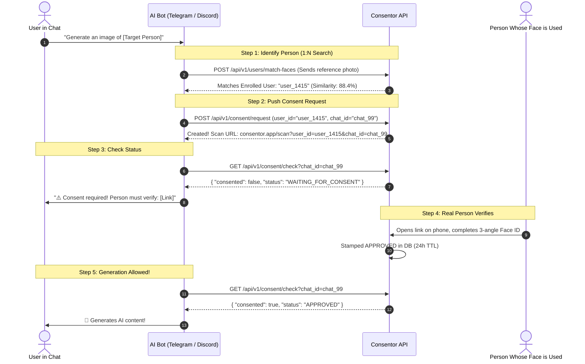

<div align="center">

# 🛡️ CONSENTOR
### The Open-Source Biometric Consent Gate for AI Generation

[](https://fastapi.tiangolo.com)
[](https://www.python.org/)
[](https://github.com/deepinsight/insightface)
[](https://opensource.org/licenses/MIT)
[](https://www.docker.com/)

**Prevent unauthorized deepfakes and non-consensual AI generation.**  
Consentor gives AI bots and generation platforms a single, lightweight API to verify that a human has granted biometric consent before an AI model synthesizes their likeness.

[Features](#-key-features) • [Architecture](#-architecture) • [Quickstart](#-quickstart-in-60-seconds) • [API Reference](#-api-endpoints-cheat-sheet) • [Bot Integration](#-bot-integration-example)

</div>

---

## 💡 The Problem

AI image generators, voice cloners, and deepfake tools can produce hyper-realistic content from a single reference photograph. Right now, bots on Telegram, Discord, and the web generate images of anyone **without their knowledge or permission**.

**Consentor solves this at the infrastructure level.**  
Before a bot invokes Midjourney, Stable Diffusion, or a voice cloner, it queries Consentor:  
👉 *"Has the person in this image/chat granted active consent?"*  
If **yes** $\rightarrow$ Generation proceeds.  
If **no** $\rightarrow$ Generation is blocked until the person completes a 3-second Face ID verification.

---

## ⚡ Key Features

- 🔒 **Zero Raw Photo Storage (Privacy-First):** Raw camera frames are processed in-memory and discarded immediately. Only mathematical 512-D normalized ArcFace vectors are stored. Compliant with **GDPR, CCPA, and BIPA**.
- 🧬 **Multi-Angle 3D Vector Profiles:** Captures 3 distinct profile angles (Center $0^\circ$, Right $+20^\circ$, Left $-20^\circ$) to eliminate the #1 flaw in facial recognition: side-angle verification failure.
- 🔍 **1:N Face Search & Identification:** Upload a query photo $\rightarrow$ compares against all enrolled vectors in $<5\text{ms}$ using vector cosine similarity to identify who needs to consent.
- ⏳ **24-Hour TTL Auto-Expiring Consents:** Granted permissions automatically expire after 24 hours (configurable), preventing permanent unauthorized access.
- 🚀 **<1ms Bot Check Latency:** External bots check consent status via indexed SQLite in under a single millisecond without stalling AI pipelines.
- 📖 **Interactive Swagger UI:** Built-in interactive documentation at `/docs` with live testing.

---

## 🏛️ Architecture & Flow



---

## 🚀 Quickstart in 60 Seconds

### Prerequisites
- Python 3.10+
- macOS, Linux, or Windows (WSL2)

### 1. Clone & Set Up
```bash
# Clone the repository
git clone https://github.com/your-username/consentor.git
cd consentor/consentor_be

# Create and activate virtual environment
python3 -m venv .venv
source .venv/bin/activate  # On Windows: .venv\Scripts\activate

# Install dependencies
pip install -r requirements.txt
```

### 2. Start the Server
```bash
python3 run.py
```

Server starts at: **`http://localhost:8000`**  
Open Swagger Docs at: **[http://localhost:8000/docs](http://localhost:8000/docs)**

---

## 🐳 Docker Deployment

```bash
# Build and run with docker-compose
docker-compose up --build -d
```

---

## 📡 API Endpoints Cheat Sheet

All endpoints are interactive at `http://localhost:8000/docs`.

| Method | Endpoint | Description |
| :--- | :--- | :--- |
| `GET` | `/api/v1/consent/check` | **Check Consent**: Verifies if `chat_id` has active consent. |
| `POST` | `/api/v1/consent/request` | **Ask Consent**: Creates a pending request and returns verification URL. |
| `POST` | `/api/v1/consent/approve` | **Approve Consent**: Manually or portal-approves `chat_id` for N hours. |
| `GET` | `/api/v1/consent/list` | **Audit Trail**: Lists all recent consent records in SQLite. |
| `POST` | `/api/v1/users/match-faces` | **1:N Face Search**: Finds matching enrolled user from photo. |
| `GET` | `/api/v1/users` | **List Users**: Returns all enrolled biometric user IDs. |
| `POST` | `/api/v1/enroll/batch` | **Batch Enroll**: Uploads 3 profile angles (0°, +20°, -20°). |
| `POST` | `/api/v1/enroll/verify` | **1:1 Face Match**: Direct selfie verification against a specific user. |

---

## 🤖 Bot Integration Example

Add Consentor to any Telegram, Discord, or web generator in **6 lines of Python**:

```python
import requests

CONSENTOR_API = "http://localhost:8000"

def generate_ai_image(chat_id: str, prompt: str):
    # 1. Query Consentor before generating
    res = requests.get(f"{CONSENTOR_API}/api/v1/consent/check", params={"chat_id": chat_id}).json()
    
    # 2. Check if active consent exists
    if res.get("consented"):
        print(f"✓ Consent active ({res['remaining_hours']}h left). Generating image for prompt: '{prompt}'...")
        # Call your AI model (Stable Diffusion / Midjourney / Flux) here
    else:
        # 3. Block and send verification link
        scan_url = res.get("consent_url")
        print(f"⚠️ Generation blocked! User must verify consent first: {scan_url}")
```

---

## 🛡️ Security & Privacy Architecture

- **No Images on Disk/S3:** Frames are streamed via `io.BytesIO` directly into InsightFace's ArcFace model (`buffalo_l`). Once 512-D vectors are calculated, image bytes are flushed from RAM.
- **Irreversible Vectors:** Mathematical embeddings cannot be converted back into facial pictures.
- **Local SQLite or Cloud S3:** Defaults to zero-config local storage with optional AWS S3 bucket streaming with `AES256` or `KMS` encryption.

---

## 🗺️ Roadmap

- [x] Multi-angle 3D head pose estimation & normalization (Straight, Right, Left)
- [x] 1:N Facial recognition search across enrolled database
- [x] Time-based TTL auto-expiration (24h default)
- [x] SQLite persistence for consent records
- [ ] Active Liveness / Anti-Spoofing detection (MiniFASNet)
- [ ] Distributed vector database adapter (Qdrant / Milvus)
- [ ] SDK libraries for Python (`pip install consentor`) & Node.js

---

## 📄 License

Distributed under the **MIT License**. See `LICENSE` for more information.

<div align="center">
Built with ❤️ for ethical AI and verifiable human consent.
</div>
